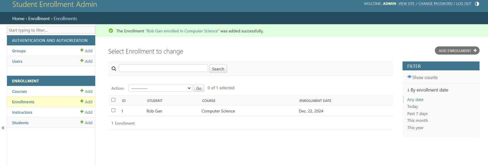

# **Student Enrollment System**

## **Group Details**
- **Group Name:** Group 8
- **Repository Link:** [Student Enrollment System - Group 8](https://github.com/Ganish-lab/Student-Enrollment-System--Group-8)
- **Group Members Unique IDs:**
  - 1: 168440
  - 2: 168120
  - 3: 169343
  - 4: 164014
  - 5: 170253
  - 6: 170389

---

## **Project Overview**
The **Student Enrollment System** is a web-based application designed to manage student enrollment in courses. It provides an API for managing students, courses, instructors, and enrollment data.

---

## **Step-by-Step Implementation**

### **1. Models and Relationships**
#### **Models:**
1. **Student**:
   - Fields: `id`, `name`, `email`, `age`, `address`.
   - Each student is uniquely identified by their `id` and can enroll in multiple courses.

2. **Instructor**:
   - Fields: `id`, `name`, `email`, `expertise`.
   - Each instructor teaches multiple courses.

3. **Course**:
   - Fields: `id`, `name`, `description`, `instructor`.
   - A course is taught by one instructor and can have multiple students enrolled.

4. **Enrollment**:
   - Fields: `id`, `student`, `course`, `enrollment_date`.
   - Represents the many-to-many relationship between students and courses.


#### **Relationships:**
- **One-to-Many**:
  - `Instructor` → `Course`
 
- **Many-to-Many**:
  - `Student` ↔ `Course` (via `Enrollment`)

---

### **2. Views/Viewsets**
- **StudentViewSet**:
  - Role: Handles CRUD operations for students.
  - Operations: `GET` (list/retrieve), `POST` (create), `PUT/PATCH` (update), `DELETE` (delete).

- **InstructorViewSet**:
  - Role: Manages instructor data.
  - Operations: Similar to `StudentViewSet`.

- **CourseViewSet**:
  - Role: Manages courses, including the assigned instructor.
  - Includes filtering by department or instructor.

- **EnrollmentViewSet**:
  - Role: Manages student-course enrollments.
  - Includes listing all enrollments for a specific student or course.


---

### **3. Serializers**
- **Purpose:** Convert data between JSON and Python objects, with validation rules.
- **Serializers:**
  - **StudentSerializer**:
    - Validates unique `email` field.
    - Ensures `age` is within a valid range.
  - **InstructorSerializer**:
    - Validates `expertise` field.
  - **CourseSerializer**:
    - Ensures the instructor exists before assigning.
  - **EnrollmentSerializer**:
    - Validates unique combinations of `student` and `course`.


---

### **4. URL Patterns**
- **Purpose:** Map HTTP requests to appropriate views or viewsets.
- **URL Overview:**
  - `/students/`: Manage students.
  - `/instructors/`: Manage instructors.
  - `/courses/`: Manage courses.
  - `/enrollments/`: Manage student enrollments.
 

All URL patterns use RESTful conventions for CRUD operations.

---

### **5. Testing**
#### **Manual Testing with Postman**
- **Steps:**
  1. **GET /students/**: Fetch all students.
  2. **POST /students/**: Add a new student.
  3. **PUT /students/{id}/**: Update student details.
  4. **DELETE /students/{id}/**: Remove a student.
  

#### **Automated Testing**
- **Test Cases**:
  - Test student creation with invalid data (e.g., missing `email`).
  - Test course creation without assigning an instructor.
  - Ensure unique constraints are enforced on `Enrollment`.

- **Execution**:
  - Run tests using Django's test framework:
    ```bash
    python manage.py test
    ```
    ## Testing Evidence

### 1. Add Student
This screenshot shows the process of adding a student:


### 2. Adding Courses
This screenshot shows the process of adding a course:


### 3. Age Validation
This screenshot demonstrates the age validation:


### 4. Automated Tests
This screenshot shows the automated test results:


### 5. Capturing Views
This screenshot shows captured views:


### 6. Delete Operation
This screenshot shows the delete operation:


### 7. Delete Success
This screenshot confirms the successful deletion:


### 8. Deleting a Record
This screenshot shows the process of deleting a record:


### 9. Enrollment
This screenshot shows enrollment functionality:


### 10. Enrollment Overview
This screenshot provides a view of the enrollment screen:


### 11. Student List
This screenshot displays the list of students:


### 12. Success Message
This screenshot shows the success message:


---


